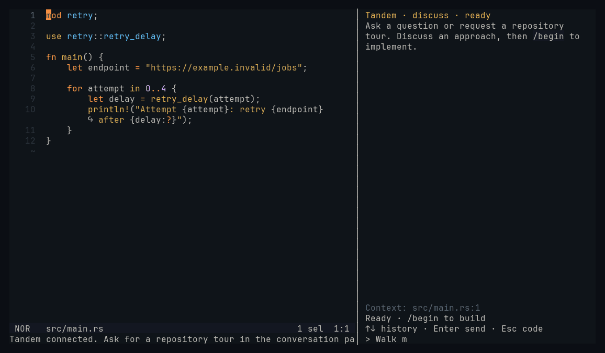
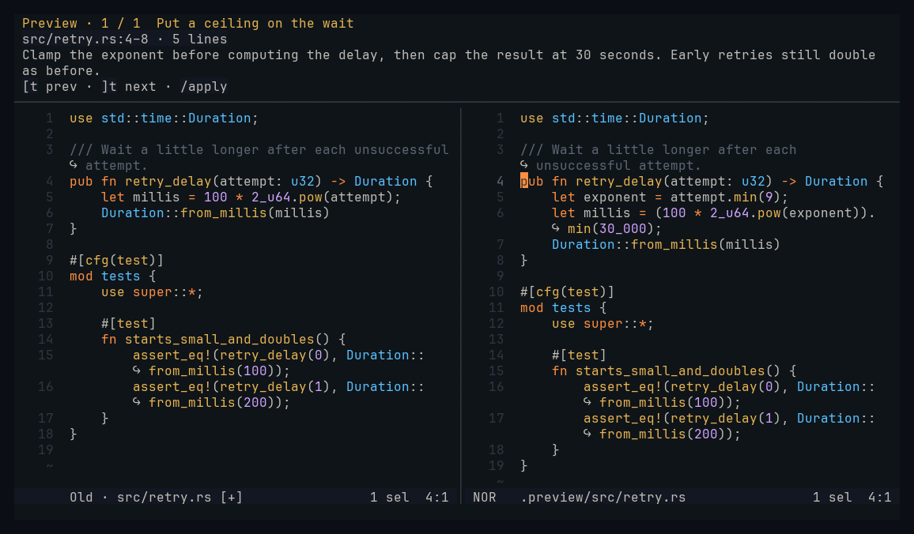

# Tandem

### Keep the code in your head.

Tandem brings an AI coding partner into Helix. Ask how something works and follow a guided tour through the actual code. Ask for a change, explore the result, and make it yours before applying it.

**Understand first. Build together. Keep control.**



_Recorded in Steelix with scripted demo responses. [Replay or reproduce the recording](docs/media/README.md)._

> **Experimental.** Linux, [Steelix](https://github.com/mattwparas/helix), and an installed, signed-in Codex CLI are required. Stock Helix does not support this plugin. Expect breaking changes while the workflow takes shape.

## “First, walk me through it.”

A tour can start before you change a single line.

```text
“Give me a quick tour of this repo.”
“Follow this request from the server to the database.”
“Before we change this, show me how it works.”
```

Tandem opens the relevant files in story order, highlights exactly what to read, and puts the explanation above your code. Use `]t` and `[t` to move forward and back. Ask “why is this needed?” in the same conversation: the assistant already has your file, selection, and current stop.

## From an idea to code you understand

1. **Talk it through.** Ask questions and explore approaches.
2. **`/begin`** builds the proposal in a separate workspace.
3. **Take the tour.** Edit the preview yourself or ask for a refinement.
4. **`/apply`** brings the saved result into your working directory as uncommitted changes.

Your real code stays in place while the proposal takes shape. Tandem does not commit on your behalf.

## Read both sides of a change

Press **Space t p** to put old code on the left and the editable proposal on the right. Native Helix buffers, syntax highlighting, and the editing keys you already know. Press it again to return to your previous layout.



The conversation stays in the editor too: a compact panel, message history on Up/Down, and a full Helix buffer when you want more room to write.

## Try it

Clone and build with Nix:

```sh
git clone https://github.com/tholoo/tandem.hx
cd tandem.hx
nix build
export PATH="$PWD/result/bin:$PATH"
```

[Install the Steelix plugin](helix/tandem/README.md#one-time-installation), then open an existing Git repository in Helix and run:

```text
:tandem
```

Start with **“Give me a quick tour of this repo.”**

[Setup and keyboard controls](helix/tandem/README.md) · [Architecture](docs/architecture.md) · [Contributing](CONTRIBUTING.md)

## What to expect today

Codex is the first live backend. The interface is designed to accommodate other providers, but Claude and OpenCode adapters are not implemented yet.

Commands that need additional permissions are currently blocked; there is no approval prompt yet. Projects with uncached dependencies may need manual setup. Sessions survive closing Helix, but restarting the controller starts a fresh session. See the [current limitations](docs/limitations.md) before trying it on important work.

Found a rough edge? A small reproduction or a short recording is especially helpful. See [contributing](CONTRIBUTING.md) for checks, demo capture, and local setup.

[MIT licensed](LICENSE).
